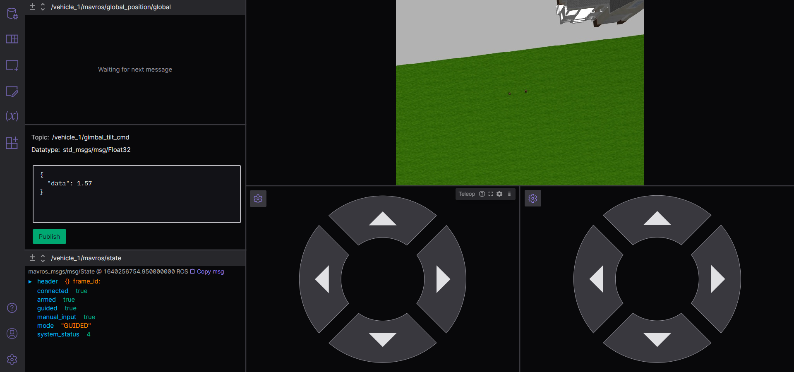

# Starling Simhost Fenswood

This is _temporary_ to develop functionality to wrap into either the main Fenswood scenario image or into the new controller example template.

Created new intermediate image with the Fenswood stuff added to the Gazebo simhost image rather than mounted as a volume.  Goal is to avoid need for student users to download the Fenswood model source material.

Also used this as a platform to experiment with "manual" driving of the simulator using ROS2 command line utilities.

## Running the simulation

Use the provided compose file: `docker-compose pull` then `docker-compose up`.

Should be able to see the Gazebo environment on [localhost:8080](http://localhost:8080) and [connect Foxglove to ws:localhost:9090](https://studio.foxglove.dev/?ds=rosbridge-websocket&ds.url=ws%3A%2F%2Flocalhost%3A9090).

Can also connect QGroundControl to `tcp:localhost:5761`.

## Flying the simulator through ROS command line tools

The following command will get you a command prompt in the MAVROS container with ROS2 all set up:
```
docker exec -it starling_simhost_fenswood_mavros_1 /bin/bash -c "source /opt/ros/foxy/setup.bash;/bin/bash"
```
Use the utility batch file ssh_mavros.bat on Windows.

Exit the container when you're done using Ctrl+D.

### Change mode

Run:
```
ros2 service call /vehicle_1/mavros/set_mode mavros_msgs/srv/SetMode "{custom_mode: "GUIDED"}"
```
On Foxglove you should see the mode change in the `/vehicle_1/mavros/state` topic. 

### Arm

Run:
```
ros2 service call /vehicle_1/mavros/cmd/arming mavros_msgs/srv/CommandBool "{value: True}"
```
Again, see the state change in Foxglove, or watch the rotors spin up in Gazebo.  

| Move quickly after this step as it'll disarm if there's no take-off command shortly after.

### Take-off

Run:
```
ros2 service call /vehicle_1/mavros/cmd/takeoff mavros_msgs/srv/CommandTOL "{altitude: 20.0}"
```
You should see the drone take off in the Gazebo and the camera image change in Foxglove. 

You can also try monitoring the relevant MAVROS topics, but this may not work if QGroundControl hasn't been connected as MAVLINK data streams have to be requested.
```
ros2 topic echo /vehicle_1/mavros/global_position/global
```

### Move the drone

Run the following (note: for reasons I don't understand, altitude relative seems to be what's published, -100):
```
ros2 topic pub --once /vehicle_1/mavros/setpoint_position/global geographic_msgs/msg/GeoPoseStamped "{pose:{position:{latitude: 51.423, longitude: -2.671, altitude: 120.0}}}"
```

### Move the camera

Use the command below, with data in range 0.0 (forwards) to 1.57 (straight down):
```
ros2 topic pub --times 5 /vehicle_1/gimbal_tilt_cmd std_msgs/msg/Float32 "{data: 1.0}"
```
| Note: it seems to need sending several times to ensure relialbe response.

### Land

To land in current location, run:
```
ros2 service call /vehicle_1/mavros/cmd/land mavros_msgs/srv/CommandTOL
```
Or to go home and land, change mode to "RTL" (Return To Land):
```
ros2 service call /vehicle_1/mavros/set_mode mavros_msgs/srv/SetMode "{custom_mode: "RTL"}"
```

## Flying through Foxglove

While in GUIDED mode, you can also control the drone by passing `Twist` messages to the `/vehicle_1/mavros/setpoint_velocity/cmd_vel_unstamped` topic.  These appear to be interpreted in the local frame, _i.e._ not the drone body frame.  Hence Z is vertical, X is East/West and Y is North/South.  With two `teleop` panels in Foxglove, you can achieve a nice manual remote control capability.  Make sure to turn the `angular X` velocities down to +/-0.1 from the default setting of 1, else the rotations are too fast.



In the example above, the left button array controls vertical translation and rotation, while the right array controls horizontal translation in the X and Y axes.  Also, the publisher box enables camera control and the state topic reports on basic vehicle status.

## Building the image

On Linux use `make build` then `make push`.

On Windows without Make, use the utilities `build.bat` and `push.bat`.

Note: push currently goes to arthurrichards77 repository on Docker hub.  Long term, this should be migrated to Starling.
